# Applant - app for Android devices to make taking care of plants easier

  

## Table of Contents
- 🚀 [Project Overview](#project-overview)
- ✨ [Features](#features)
- 💻 [Technologies](#technologies)
- 📋 [Requirements](#requirements)
- 🛠️ [Setup Instructions](#setup-instructions)
- 📸 [Screenshots](#screenshots)

## Project Overview
Applant is an application that allows you to manage and control the activities you perform with houseplants. Its operation is supported by an external API, which enables the implementation of many helpful functionalities. **The application is available in English language version!**

## Features
- 🌱 Adding, deleting and editing owned plants
- 🏠 Adding, deleting, editing rooms and the ability to assign plants to them
- 📸 Ability to add a photo (or select one of 15 default ones), description, watering frequency and a note to each plant
- 🖼️ Ability to add a photo (or select one of 9 default ones) and description for each room
- 📝 Recording of waterings, fertilizings and repottings performed of each plant
- 🔍 Ability to identify the species of the plant based on its photo
- 💧 Viewing of all plants assigned to a room and the ability to water all plants in the room at the same time 
- 🩺 Diagnosis of problems with the plant based on the photo 
- ⏰ Notifications informing about the need to water a particular plant and the ability to set the time at which we are to receive these notifications 
- 🌙 Dark mode of the application 
- 🌍 2 language versions (English, Polish) 
- 📱 Compatibility with different types of devices that can install .apk files (phones, tablets, laptops ChromeOS)

## Technologies
- Kotlin
- plant.id AI Plant Identification API by kindwise
- Pl@ntNet API for developers

## Requirements

Device with Android 8.0 (SDK 26) or later.

## Setup Instructions
(The application is not available on Google Play at this time)

1. Download the `Applant.apk` file.
2. Give your browser permission to install the application from unknown sources.
3. install the application.

## Screenshots

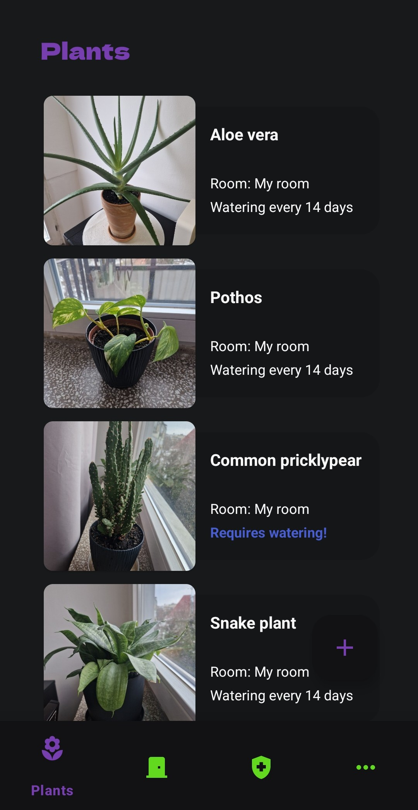 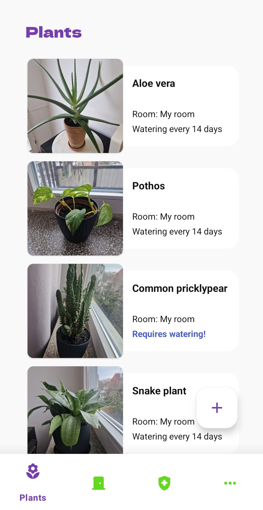
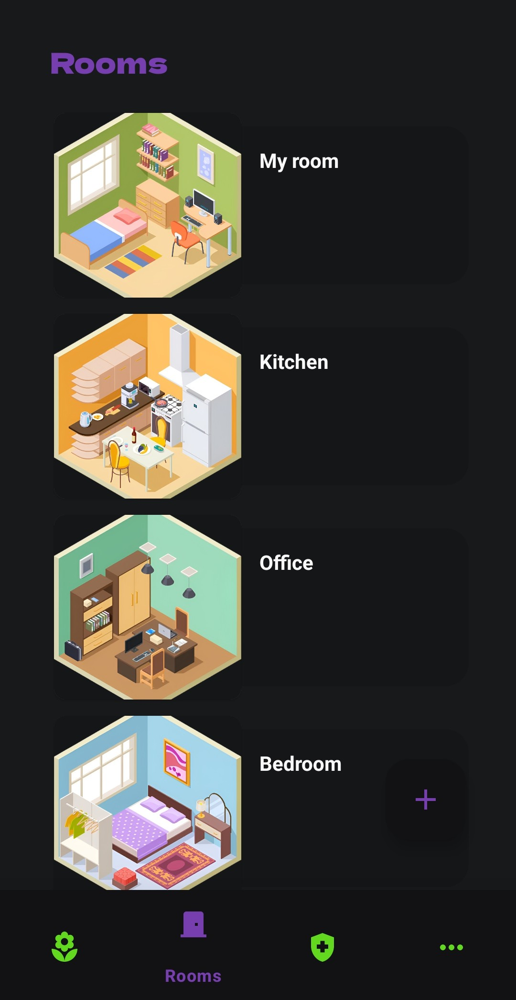 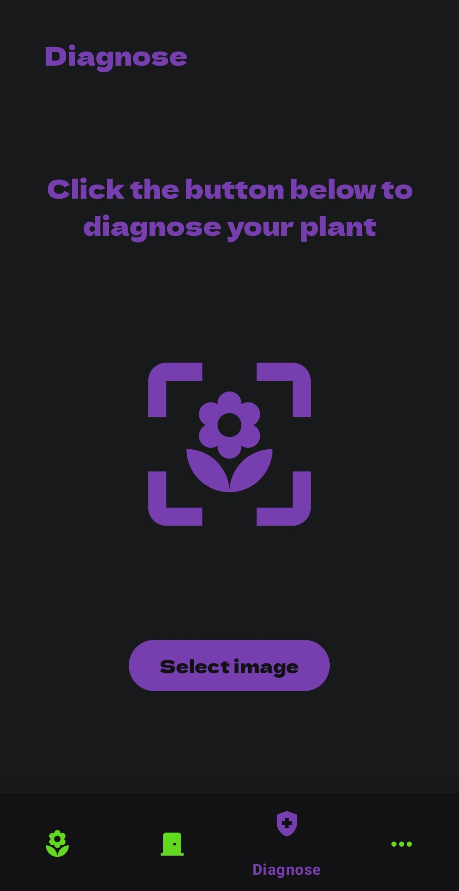
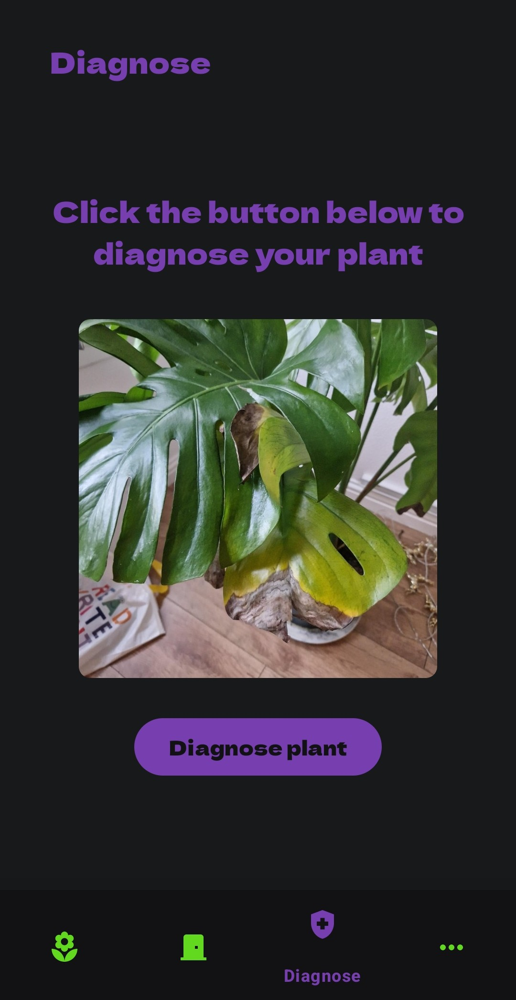 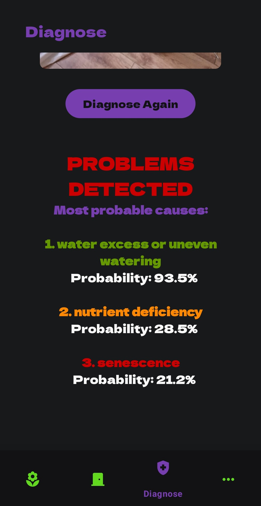
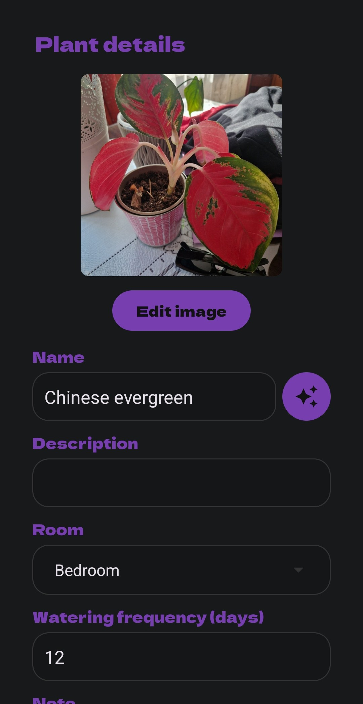 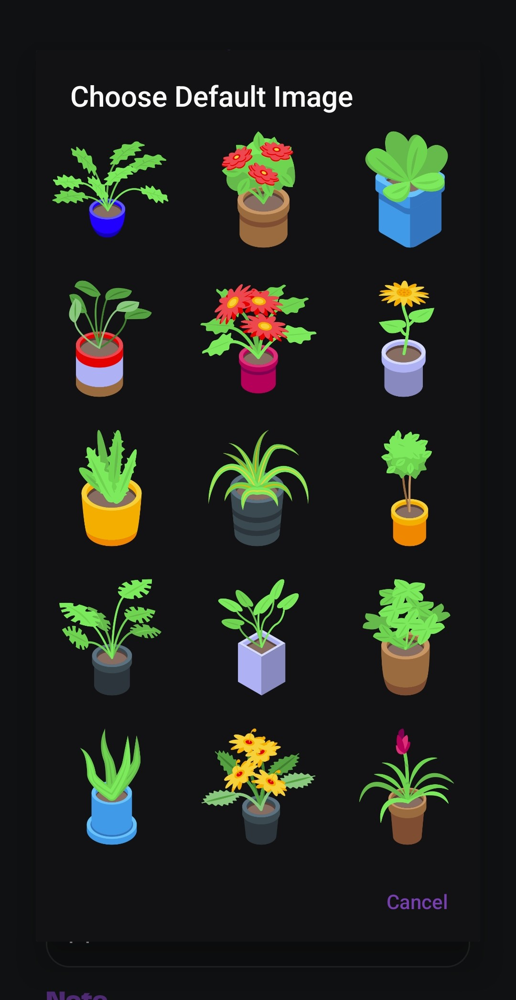
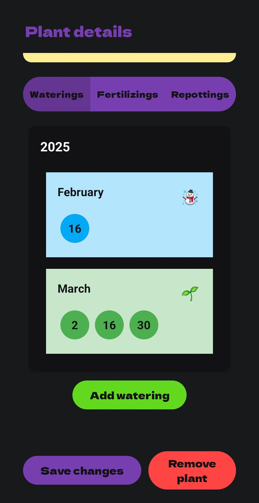 

    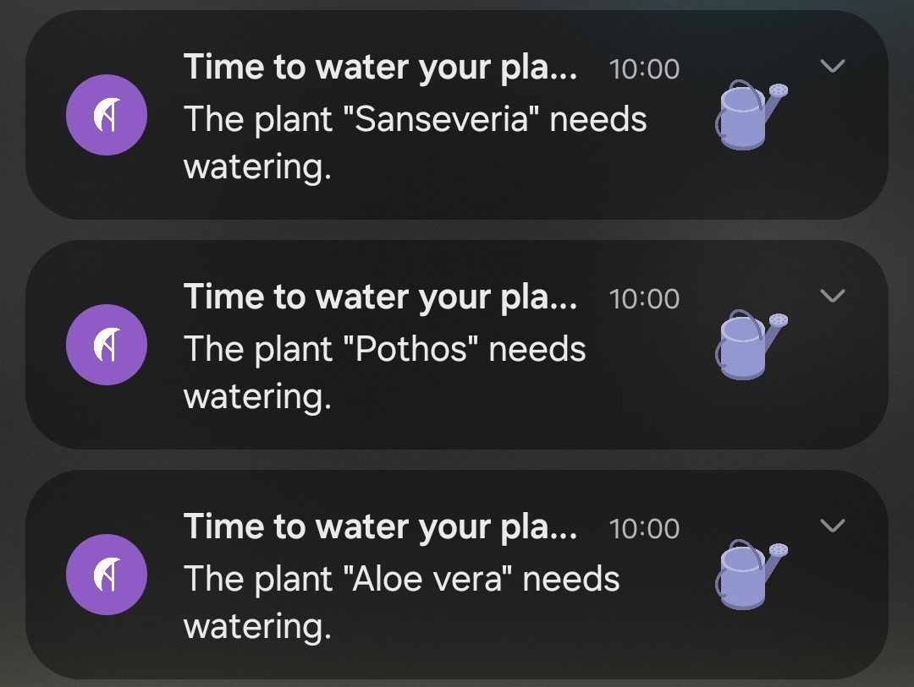

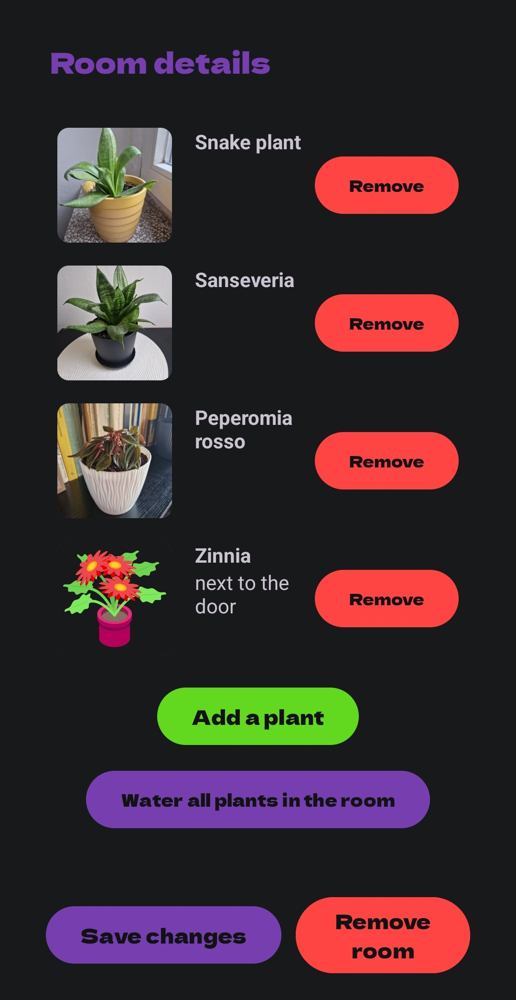 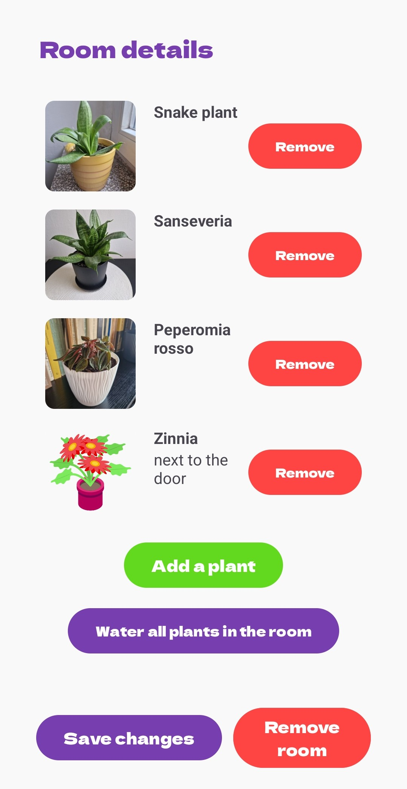
 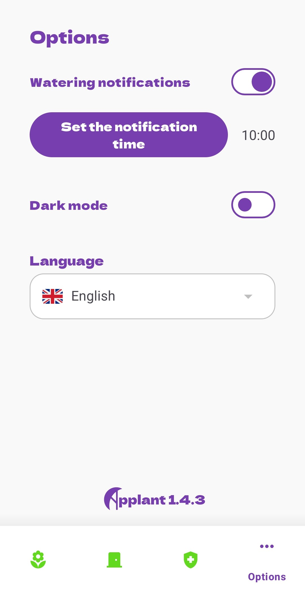
